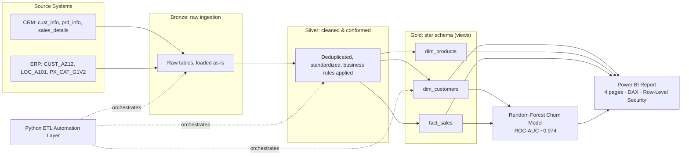

# 🏬 Retail Sales Data Warehouse & Analytics Platform


> A complete data platform, start to finish. Raw CRM and ERP exports flow through a medallion-style MySQL warehouse. Python automates the whole pipeline. A Random Forest model predicts customer churn from the warehouse data. Everything is presented in a four-page Power BI report secured with row-level security.

---

## 📑 Contents

- [Project Summary](#-project-summary)
- [Architecture](#-architecture)
- [Core Components](#-core-components)
- [Technologies Used](#-technologies-used)
- [Source Data](#-source-data)
- [Folder Layout](#-folder-layout)
- [Getting Started](#-getting-started)
- [Outcomes](#-outcomes)

---

## 🔎 Project Summary

The business data comes from two separate systems, a **CRM** and an **ERP**. The two do not agree with each other: dates are written in different formats, the same customer appears more than once, and product categories are labelled inconsistently.

This project fixes that. It cleans and aligns the data, then models it into one **star schema**. On top of that foundation, it adds two more layers:

- 🤖 **Machine learning layer:** finds customers who are likely to churn.
- 📊 **BI layer:** gives non-technical business users an easy way to explore the data.

---

## 🏗 Architecture

The warehouse is built on the **medallion architecture** (Bronze → Silver → Gold). Every layer lives in its own MySQL database.



### What each layer does

| Layer | Role |
| ----- | ---- |
| 🥉 **Bronze** | Holds the raw CRM/ERP data exactly as received, with no changes, so nothing from the source is lost. |
| 🥈 **Silver** | Removes duplicates using `ROW_NUMBER()`, converts dates using `STR_TO_DATE()`, and standardizes keys and categories. All of this runs inside stored procedures. |
| 🥇 **Gold** | Business-ready views on a star schema: `dim_customers`, `dim_products`, and `fact_sales`, plus the reporting views `report_customers` and `report_products`. Surrogate keys are created with `ROW_NUMBER()`. |

---

## 🧩 Core Components

### 1️⃣ SQL Data Warehouse (MySQL)
Bronze, Silver, and Gold each sit in a separate database. The Gold layer uses a star schema. Data moves from one layer to the next through stored procedures.

### 2️⃣ Python ETL Automation
`run_pipeline.py` runs the full Bronze → Silver → Gold flow from end to end. It uses **SQLAlchemy** and **mysql-connector-python** and triggers the MySQL stored procedures with `callproc()`. Database credentials come from environment variables (a `.env` file that is never committed), so nothing sensitive is hardcoded.

### 3️⃣ Churn Prediction Model
A **Random Forest classifier** (`churn_model.py`) is trained on customer data from the Gold layer.

- **Churn definition:** a customer counts as churned if they have not bought anything in the last 90 days.
- **Features:** RFM (Recency, Frequency, Monetary).
- **Performance:** about **0.974 ROC-AUC**.
- **Output:** predictions are saved to `gold.customer_churn_scores`, which the Power BI report reads.

### 4️⃣ Power BI Report
The report has four pages and is built on the Gold-layer views. It includes 13 custom DAX measures, row-level security, a custom navy and teal theme, and a dedicated DateTable for time intelligence.

- 📌 **Executive Summary**
- 📌 **Customer & Churn Risk**
- 📌 **Product Performance**
- 📌 **RFM Segmentation**

---

## 🛠 Technologies Used

| Area | Tools |
| ---- | ----- |
| 🗄 **Database** | MySQL, MySQL Workbench |
| 🔄 **ETL** | SQL stored procedures, Python (SQLAlchemy, mysql-connector-python) |
| 🧠 **Machine Learning** | Python, scikit-learn (Random Forest) |
| 📈 **BI & Reporting** | Power BI, DAX, Row-Level Security |

---

## 📂 Source Data

| System | Files |
| ------ | ----- |
| **CRM** | `cust_info.csv`, `prd_info.csv`, `sales_details.csv` |
| **ERP** | `CUST_AZ12.csv`, `LOC_A101.csv`, `PX_CAT_G1V2.csv` |

---

## 🗂 Folder Layout

```
Data-warehouse-Project/
├── datasets/       # Source CSV files (CRM + ERP)
├── docs/           # Architecture notes, data catalog, naming rules
├── scripts/
│   ├── database creation/
│   ├── Bronze/     # Scripts for raw data loading
│   ├── silver/     # Cleaning & transformation procedures
│   └── Gold/       # Star schema view definitions
├── etl/            # Python automation for the pipeline
├── ml/             # Churn prediction notebook + model
├── power-bi/       # .pbix file + report screenshots
├── tests/          # Data quality checks
└── README.md
```

---

## 🚀 Getting Started

1. **Create the databases.** In MySQL Workbench, run the scripts in `scripts/database creation/` to set up the Bronze, Silver, and Gold databases.
2. **Load the raw data.** Run the Bronze scripts to import the CSV files from `datasets/`.
3. **Clean the data.** Run the Silver procedures to clean and standardize everything.
4. **Build the star schema.** Run the Gold scripts to create the views.
5. **Run the Python pipeline.** *(fill in: the command or entry point for the Python ETL script)*
6. **Explore the report.** Open `power-bi/*.pbix` in Power BI Desktop and refresh it against the Gold layer.

---

## ✅ Outcomes

- Two disconnected source systems were cleaned, deduplicated, and merged into one star schema.
- The churn model reaches about **0.974 ROC-AUC** on held-out data.
- The Power BI report offers secure, role-based access to sales, customer, and product insights across 4 pages.

---

*This project is adapted from a SQL Server data warehouse course. It was rebuilt for MySQL and extended with Python automation, machine learning, and BI layers.*
